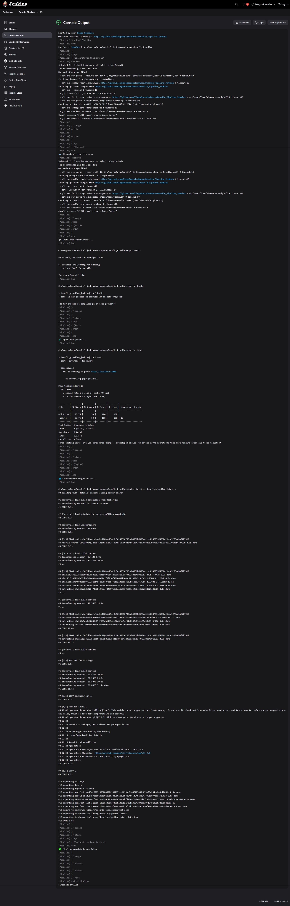

# Proyecto API de Tareas

Este proyecto demuestra una API simple en Node.js para la gestión de tareas, integrada con Docker para la contenedorización y Jenkins para la canalización CI/CD.

## Características

- Listar todas las tareas  
- Obtener una tarea por ID  

## Ejecutar localmente  

instalacion de dependencia de devDependencies

```bash
npm install jest supertest eslint -D
```
1. Install dependencies: `npm install`  
2. Start the server: `npm start`

## Running with Docker

1. Build the image: `docker build -t desafio-pipeline:latest .`  
2. Run the container: `docker run -p 3000:3000 desafio-pipeline:latest .`

## Jenkinsfile para CI/CD

Este archivo `Jenkinsfile` define un pipeline de integración y despliegue continuo (CI/CD) para una aplicación Node.js.  

### 📌 Etapas del Pipeline  
1. **Checkout**: Clona el repositorio.  
2. **Build**: Instala las dependencias y construye la aplicación.  
3. **Test**: Ejecuta las pruebas automatizadas.  
4. **Deploy**: Construye una imagen Docker de la aplicación.  
5. **Post**: Muestra mensajes de éxito o error según el resultado del pipeline.  

### 🛠️ Configuración en Jenkins  
Para ejecutar este pipeline en Jenkins, asegúrate de:  
- Tener Docker instalado y en ejecución.  
- Contar con Node.js en la versión especificada (`18` en este caso).  
- Tener un agente de Jenkins configurado para ejecutar scripts en Windows (ya que se usa `bat` en lugar de `sh`).  

### 🔧 Jenkinsfile 
 
```jenkinsfile
pipeline { 
    agent any 
    environment { 
        NODE_VERSION = '18' // Cambia si usas otra versión de Node.js 
    } 

    stages { 
        stage('Checkout') { 
            steps { 
                echo "📥 Clonando el repositorio..." 
                checkout scm 
            } 
        } 

        stage('Build') { 
            steps { 
                script { 
                    try { 
                        echo "⚙️ Instalando dependencias..." 
                        bat 'npm install' 
                        bat 'npm run build' 
                    } catch (Exception e) { 
                        error("❌ Error en la etapa de Build") 
                    } 
                } 
            } 
        } 

        stage('Test') { 
            steps { 
                script { 
                    try { 
                        echo "🧪 Ejecutando pruebas..." 
                        bat 'npm run test' 
                    } catch (Exception e) { 
                        error("❌ Error en la etapa de Test") 
                    } 
                } 
            } 
        } 

        stage('Deploy') { 
            steps { 
                script { 
                    try { 
                        echo "🐳 Construyendo imagen Docker..." 
                        bat 'docker build -t desafio-pipeline:latest .' 
                    } catch (Exception e) { 
                        error("❌ Error en la etapa de Deploy") 
                    } 
                } 
            } 
        } 
    } 

    post { 
        success { 
            echo "✅ Pipeline completado con éxito" 
        } 
        failure { 
            echo "❌ El pipeline ha fallado" 
        } 
    } 
}
```

## Output consola Jenkins:

Documentado a la vez en REPORT.md


